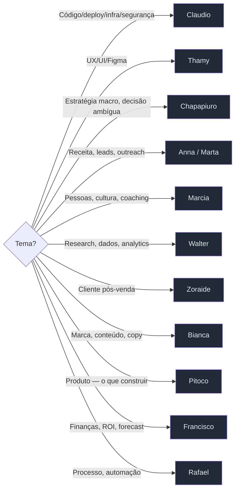

# Sala do Conselho — Mapa visual

## Hierarquia completa

```mermaid
flowchart TB
    S([Sophia · 0613-B<br/>External Presidency])

    subgraph RECEITA["💰 RECEITA"]
        Anna[Anna<br/>CSO · Sales]
        Marta[Marta<br/>CGO · Growth]
        Bianca[Bianca<br/>CMO · Marketing]
    end

    subgraph FINEST["💼 FINANÇAS & ESTRATÉGIA"]
        Francisco[Francisco<br/>CFO · Finance]
        Chapapiuro[Chapapiuro<br/>CSO · Strategy]
    end

    subgraph OPTECH["⚙️ OPERAÇÕES & TECH"]
        Rafael[Rafael<br/>COO · Operations]
        Claudio[Claudio<br/>CTO · Technology]
    end

    subgraph PRODDES["🎨 PRODUTO & DESIGN"]
        Pitoco[Pitoco<br/>CPO · Product]
        Thamy[Thamy<br/>CDO · Design]
    end

    subgraph KNOWPEOPLE["📚 CONHECIMENTO & GENTE"]
        Walter[Walter<br/>CKO · Knowledge+Data]
        Marcia[Marcia<br/>CHRO · People]
    end

    subgraph CLIENTE["❤️ CLIENTE"]
        Zoraide[Zoraide<br/>CCO · Customer]
    end

    %% Subagentes operacionais
    Ana_sub[🤖 Ana · WhatsApp Kommo]
    Kimi_sub[🤖 Kimi · sync CRM]
    Insights_sub[🤖 Insights · analytics]

    S --> Anna & Marta & Bianca
    S --> Francisco & Chapapiuro
    S --> Rafael & Claudio
    S --> Pitoco & Thamy
    S --> Walter & Marcia
    S --> Zoraide

    Anna -.comando.-> Ana_sub
    Rafael -.comando.-> Kimi_sub
    Walter -.comando.-> Insights_sub

    classDef center fill:#7c3aed,stroke:#a78bfa,color:#fff,stroke-width:2px
    classDef sub fill:#1f2937,stroke:#6b7280,color:#d1d5db,stroke-dasharray: 3 3
    class S center
    class Ana_sub,Kimi_sub,Insights_sub sub
```

---

## Roteamento — quando Sophia chama quem

---

## Tabela consolidada

| # | Diretor | Cargo · Área | Skills principais | MCPs | Subagente |
|---|---|---|---|---|---|
| 0 | **Sophia** | Presidência (0613-B) | orquestração, routing | — | — |
| 1 | **Anna** | CSO · Sales | lead-intelligence · investor-outreach · social-graph-ranker · connections-optimizer | Clay · HubSpot · Close · ClickUp | **Ana** (WhatsApp) |
| 2 | **Bianca** | CMO · Marketing | brand-voice · seo · content-engine · crosspost · article-writing · x-api | Ahrefs · Similarweb · Webflow · Bitly · Windsor.ai · Gamma | — |
| 3 | **Francisco** | CFO · Finance | finance-billing-ops · customer-billing-ops · ecc-tools-cost-audit · investor-materials | Supabase | — |
| 4 | **Marta** | CGO · Growth | market-research · connections-optimizer · social-graph-ranker · lead-intelligence · seo | Ahrefs · Similarweb · Firecrawl · x-api | — |
| 5 | **Rafael** | COO · Operations | automation-audit-ops · project-flow-ops · workspace-surface-audit · terminal-ops · unified-notifications-ops · github-ops | ClickUp · Slack · Gmail · Google Calendar · GitHub | **Kimi** (CRM sync) |
| 6 | **Claudio** | CTO · Technology | backend-patterns · frontend-patterns · database-migrations · deployment-patterns · docker-patterns · mcp-server-patterns · api-design · security-review · security-scan · security-bounty-hunter | Supabase · Vercel · GitHub · Context7 · Chrome DevTools · Playwright | — |
| 7 | **Thamy** | CDO · Design | frontend-design · liquid-glass-design · figma-implement-design · figma-generate-design · figma-generate-library · ui-demo · frontend-slides | Figma · Stitch · Excalidraw | — |
| 8 | **Zoraide** | CCO · Customer | messages-ops · email-ops · customer-billing-ops | Gmail · Slack · Close · HubSpot | — |
| 9 | **Walter** | CKO · Knowledge+Data | knowledge-ops · deep-research · research-ops · exa-search · iterative-retrieval · huggingface-* · clickhouse-io · postgres-patterns | Notion · NotebookLM · Hugging Face · Firecrawl · Supabase | **Insights** (analytics) |
| 10 | **Pitoco** | CPO · Product | product-capability · prp-prd · prp-plan · api-design · e2e-testing · ai-regression-testing | Playwright · Miro · Figma | — |
| 11 | **Marcia** | CHRO · People | developmental-coach · content-engine (interno) | Notion · ClickUp · Slack | — |
| 12 | **Chapapiuro** | CSO · Strategy | blueprint · council · market-research · investor-materials · deep-research | Notion · Miro · Firecrawl | — |

---

## Notas

- **2 CSOs** — Anna (Sales) e Chapapiuro (Strategy). Sempre cite com cargo.
- **Sophia = único agente**, os 12 são skills especializadas dela (com prompts + MCPs).
- **Subagentes operacionais** (Ana, Kimi, Insights) são bots Python rodando no DAP4 stack — reportam pros diretores.
- **Thales (você)** é o CEO implícito — Sophia é presidência simbólica/externa.
- Fonte canônica: `PITOS/Sistemas/sennin-protocol.md`.
- Orbital visual no app: `https://dap.doctorautoprime40.com/parliament`.
